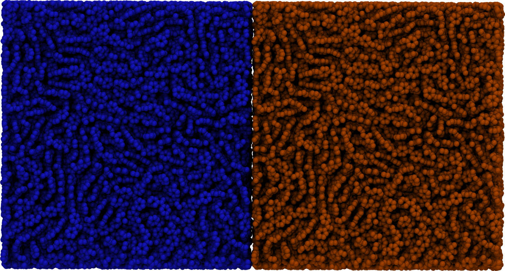
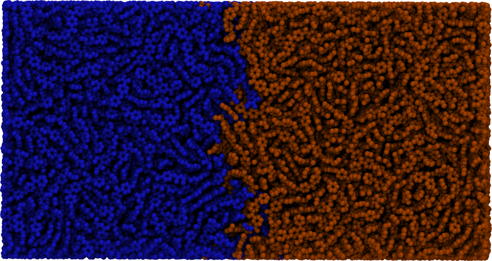
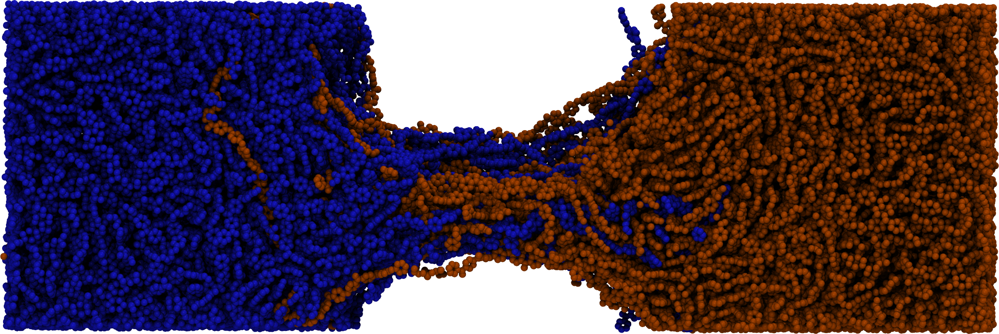

[](https://joss.theoj.org/papers/75c5135b3e0eb1b561a89783ce949067)
[](https://github.com/cmelab/flowerMD/actions/workflows/pytest.yml)
[](https://codecov.io/gh/cmelab/flowerMD)
[](https://anaconda.org/conda-forge/flowermd)
[](https://anaconda.org/conda-forge/flowermd)
## flowerMD: Flexible Library of Organic Workflows and Extensible Recipes for Molecular Dynamics
flowerMD is a modular “wrapper” package for molecular dynamics (MD)
simulation pipeline development, designed to enable fast, reproducible,
end-to- end simulation workflows with minimal user effort. This package is a
wrapper for [MoSDeF](https://github.com/mosdef-hub) packages and
[Hoomd-Blue](https://github.com/glotzerlab/hoomd-blue) with a focus on
simulating soft matter systems.

An object-oriented design makes flowerMD extensible and highly flexible.
This is bolstered by a library-based approach to system initialization, making
flowerMD agnostic to system identity, forcefield, and thermodynamic
ensemble, and allowing for growth on an as-needed basis.

  

Installing flowermd
===================

Installing `flowermd` from the `conda-forge` channel can be achieved by adding `conda-forge` to your channels with:

```
conda config --add channels conda-forge
conda config --set channel_priority strict
```

Once the `conda-forge` channel has been enabled, `flowermd` can be installed with `conda`:

```
conda install flowermd
```

or with `mamba`:

```
mamba install flowermd
```

**Installing from source for development:**

Clone this repository:

```
git clone git@github.com:cmelab/flowerMD.git
cd flowerMD
```

Set up and activate environment:

```
conda env create -f environment-dev.yml
conda activate flowermd-dev
python -m pip install -e .
```

**A note on GPU compatibility:**

To install a GPU compatible version of HOOMD-blue in your flowerMD
environment, you need to manually set the CUDA version **before installing flowermd**.
This is to ensure that the HOOMD build pulled from conda-forge is compatible with your CUDA version.
To set the CUDA version, run the following command before installing flowermd:
```
export CONDA_OVERRIDE_CUDA="[YOUR_CUDA_VERSION]"
```

## Basic Usage
Please check out the [tutorials](tutorials) for a detailed description of
how to use flowerMD and what functionalities it provides.

## Documentation
Documentation is available at [https://flowermd.readthedocs.io](https://flowermd.readthedocs.io)

## Citing flowerMD
If you use flowerMD in your research, please cite the following paper:

Albooyeh, M., Jones, C., Barrett, R., & Jankowski, E. (2023). FlowerMD: Flexible Library of Organic Workflows and Extensible Recipes for Molecular Dynamics. Journal of Open Source Software, 8(92), 5989, https://doi.org/10.21105/joss.05989

## Contributing to flowerMD
We welcome all contributions to flowerMD. Please see
[contributing guidelines](CONTRIBUTING.md) for more information.


[//]: # (#### Using the built in molecules, systems and forcefields:)

[//]: # (README, documentation and tutorials are a work in progress.)
